# Susquehanna-Algothon-26-Strategy

Strategy, simulations and backtests for SIG Algothon '26.

All figures below are generated by the scripts in this repo (running against `prices.txt`, 51 instruments x 1000 days) and live under [`figures/`](figures).

## Repository layout

| File | Purpose |
| --- | --- |
| `LarpSharpe.py` | Main strategy — v8 stat-arb engine with a null-calibrated roster gate and tiered sizing (v9). Exposes `getMyPosition(prcSoFar)`. |
| `backtest_is_oos_dpnl.py` | IS/OOS backtester — daily PnL and per-instrument performance, limit utilization, and fee/traded-volume economics. |
| `eval.py` | Official evaluation script plus statistical tests on the daily-PnL distribution. |
| `score_over_time.py` | Score-over-time chart (quarterly and rolling-daily score). |
| `visualcheck.py` | Visual sanity check — stock prices over time. |
| `prices.txt` | Whitespace-delimited price matrix (one instrument per column, header row of tickers). |

## `LarpSharpe.py` — main strategy

The main strategy: the v8 mean-reversion engine (sleeves 22/6/23, `HEDGE_K=1.0`, `GROSS_SCALE=2.0`) driving a roster of cointegrated pairs and LASSO-discovered baskets. v9 adds a null-calibrated roster gate: pair/basket selection is benchmarked against factor-null simulations (real PC1-3 factor paths with fresh random-walk idiosyncratics), and marginal pairs that the null can explain are kept but sized down onto a probation tier (LEG 30k / 22k / 14k) instead of being excluded, since capacity dominates the score once the Sharpe ratio clears ~3.

For submission the file is renamed to `strategy.py` (`eval.py` imports `getMyPosition`). Roster rebuild and dev tooling live under `__main__` (`--rebuild-roster`).

## `backtest_is_oos_dpnl.py` — daily PnL and individual instrument performance

Mirrors `eval.py` economics (fees, dollar position limits, integer clipping, mark-only last day) but scores IS and OOS windows separately: by default IS is days 50-160 and OOS is days 160-1000 (the official eval window). It runs one continuous replay so inventory carries into the official window, plus a fresh flat-start replica of the official run, and reports window summaries, 50-day blocks, an overfit sniff test, and per-instrument cost economics.

```bash
python backtest_is_oos_dpnl.py --strategy LarpSharpe
```

IS/OOS cumulative and daily PnL:

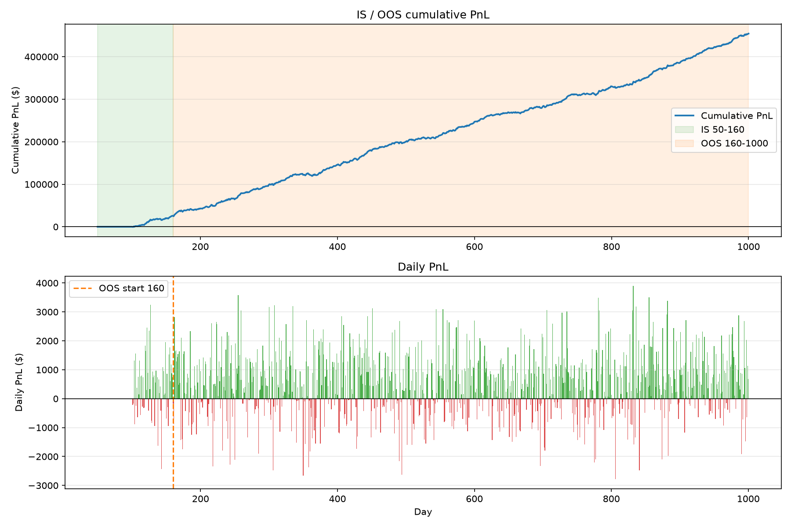

Daily (not cumulative) net PnL for every instrument, with a 21-day rolling mean and the OOS start marked:

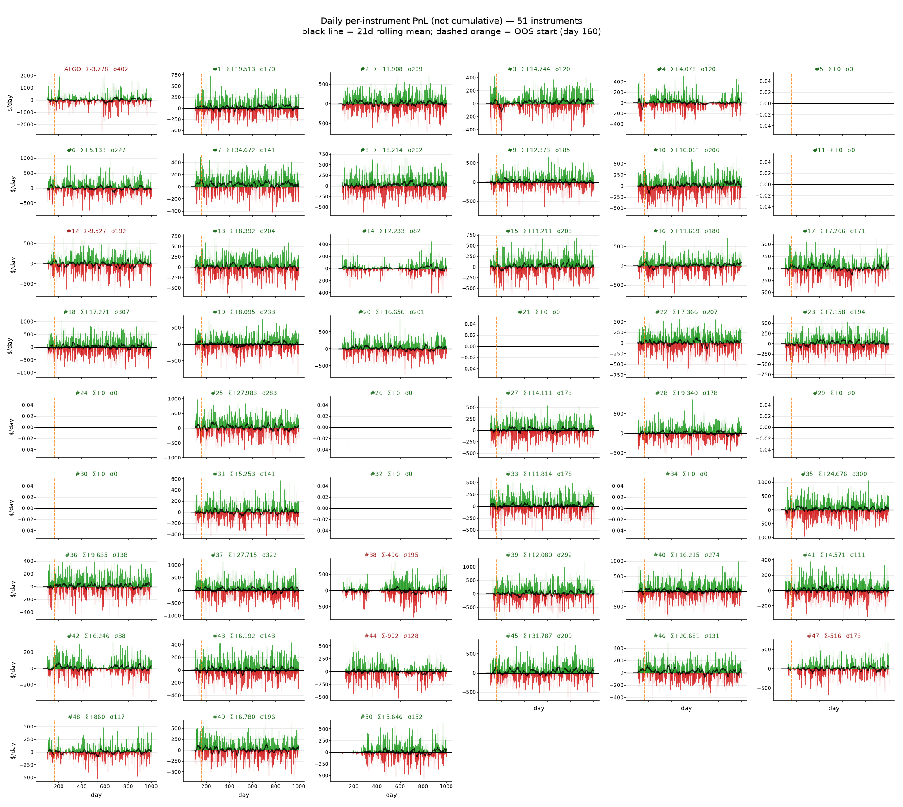

Per-instrument cumulative PnL (top 10 by |total|) and total PnL for all 51 instruments:

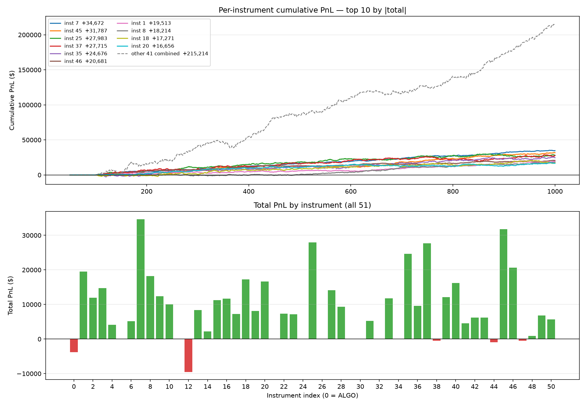

Rolling 63-day net PnL per dollar traded per instrument, against each instrument's commission hurdle (1 bp everywhere, 0.2 bp on ALGO):

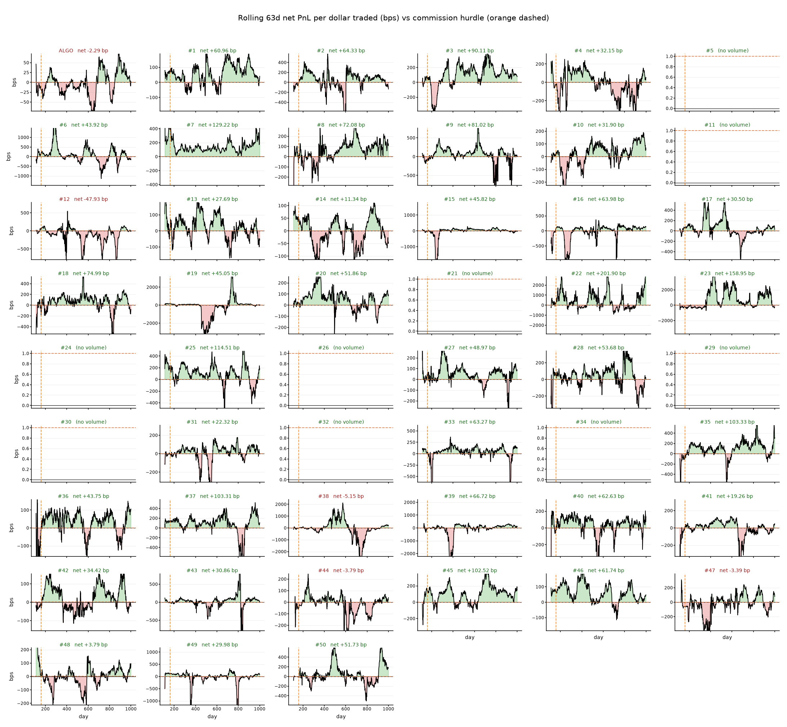

Fee / traded-volume economics — traded volume, fees, fee rate (build check), and the panel that matters: gross edge vs commission hurdle per dollar traded (a red bar means the instrument does not earn back its own commission):

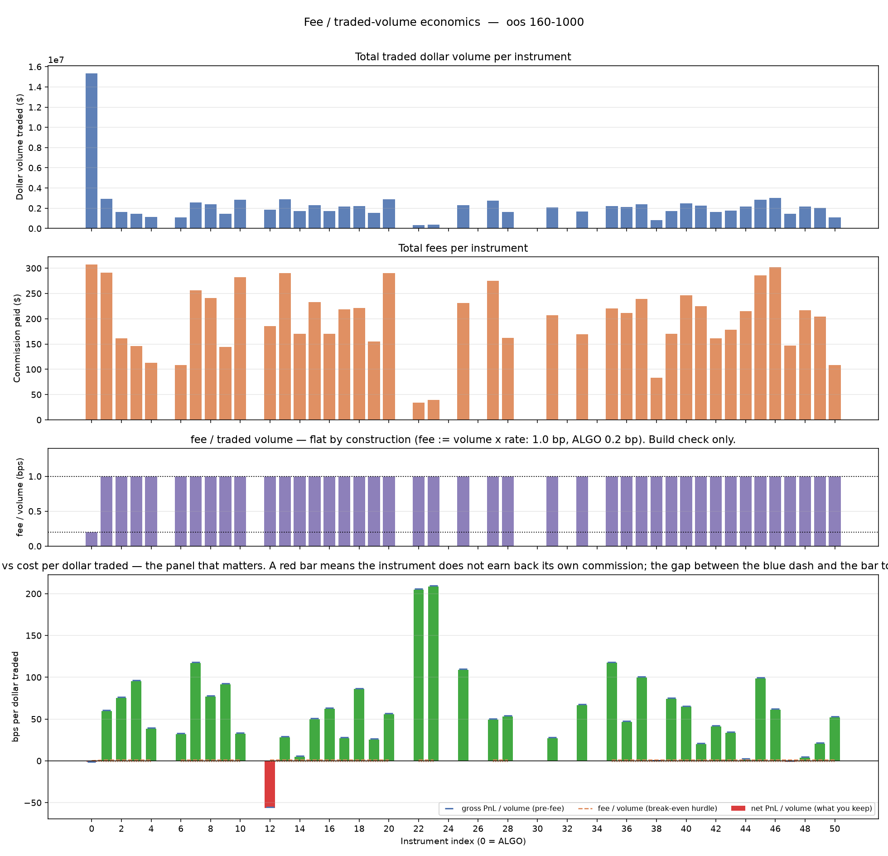

Dollar-limit utilization — portfolio-level capacity in use through time (non-ALGO $10k caps vs ALGO's $100k cap) and per-instrument mean/max utilization:

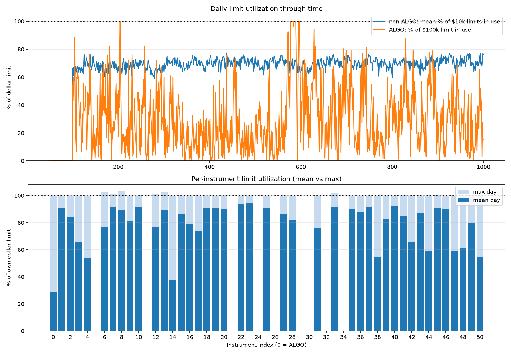

## `eval.py` — statistical tests

The Algothon 2026 evaluation script: replays the strategy over the scoring window (days 160-1000), applying commissions (1 bp, 0.2 bp on instrument 0) and dollar position limits ($10k, $100k on instrument 0), and reports mean PnL, Sharpe, and the official score `mu * SR^2 / (SR^2 + 1)`. On top of that it runs statistical tests on the daily-PnL distribution: moments (skew, excess kurtosis) and normality tests (Shapiro-Wilk, Jarque-Bera, Anderson-Darling), with a verdict at the 5% level.

```bash
ALGOTHON_STRATEGY=LarpSharpe python eval.py
```

Daily PnL over the scoring window, with 50-day block score and block mean overlays:

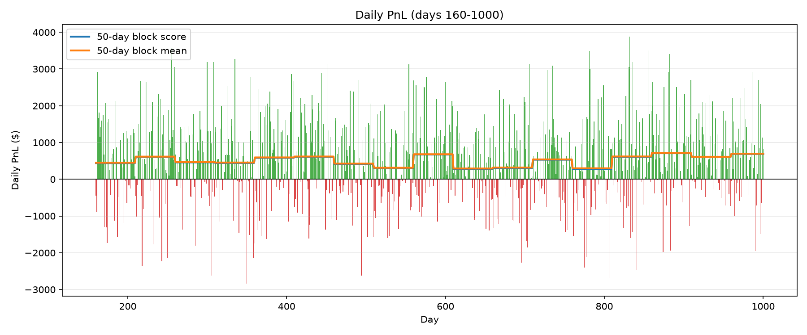

Daily-PnL distribution with normal and KDE overlays and the normality-test results (for `LarpSharpe`, all three tests fail to reject normality at 5%):

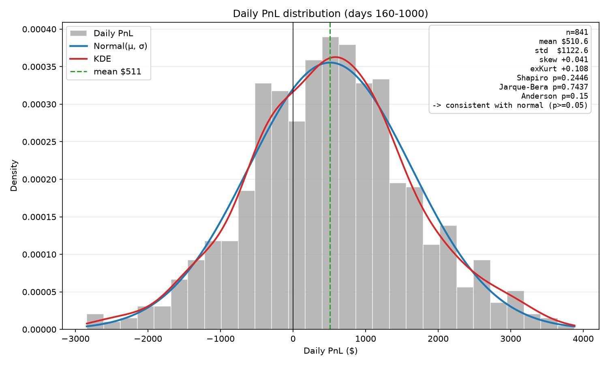

## `score_over_time.py` — score over time

As the name says: plots the strategy's score through time using `eval.py`'s scoring function at two temporal resolutions on one axis — a discrete 8-quarter score (fixed 125-day windows) and a daily rolling continuous score (125-day trailing window by default).

```bash
ALGOTHON_STRATEGY=LarpSharpe python score_over_time.py
```

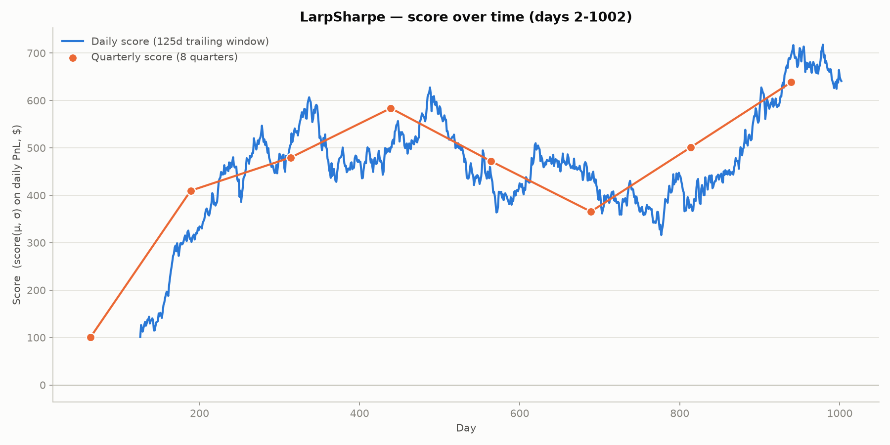

## `visualcheck.py` — stock prices over time

Visual sanity check for `prices.txt`: reads the price matrix and produces three figures — a labelled grid of individual price plots (one per instrument), all instruments overlaid at absolute prices, and all instruments overlaid normalised to their day-0 price.

```bash
python visualcheck.py
```

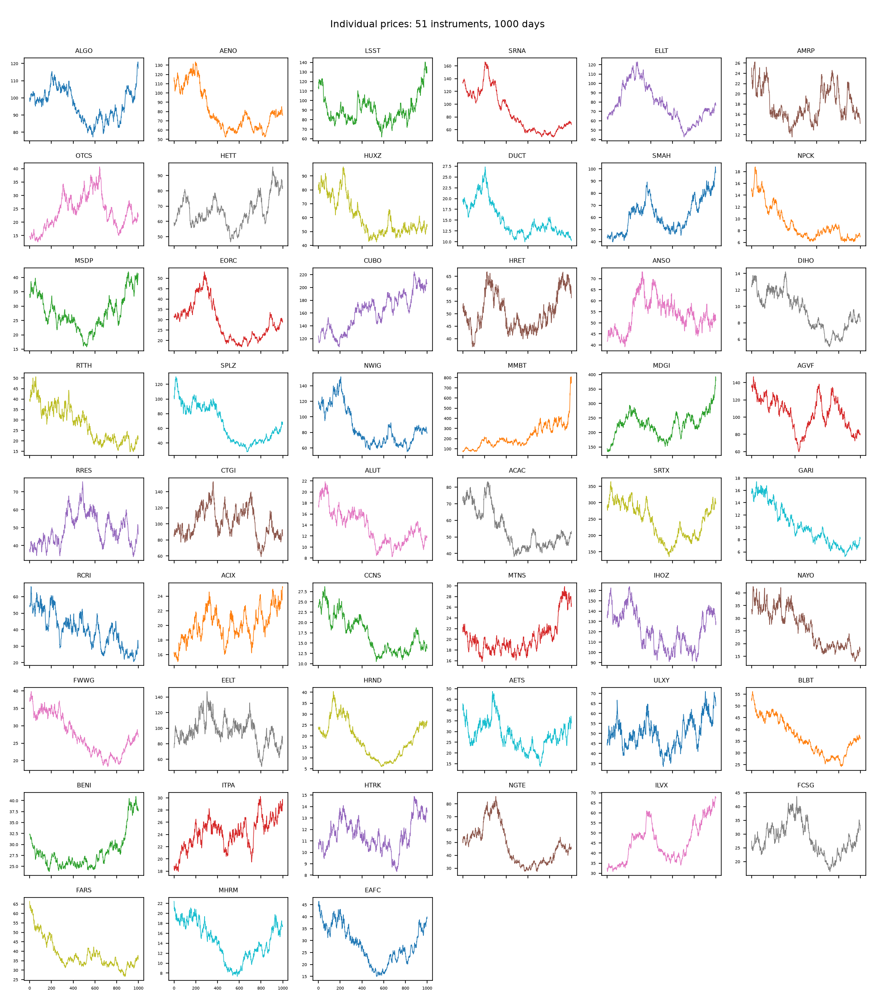

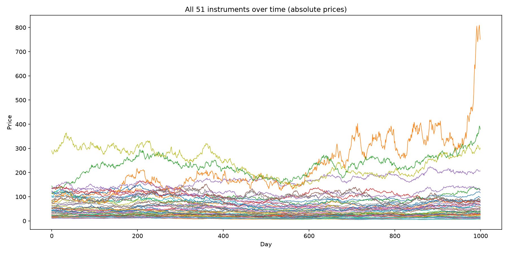

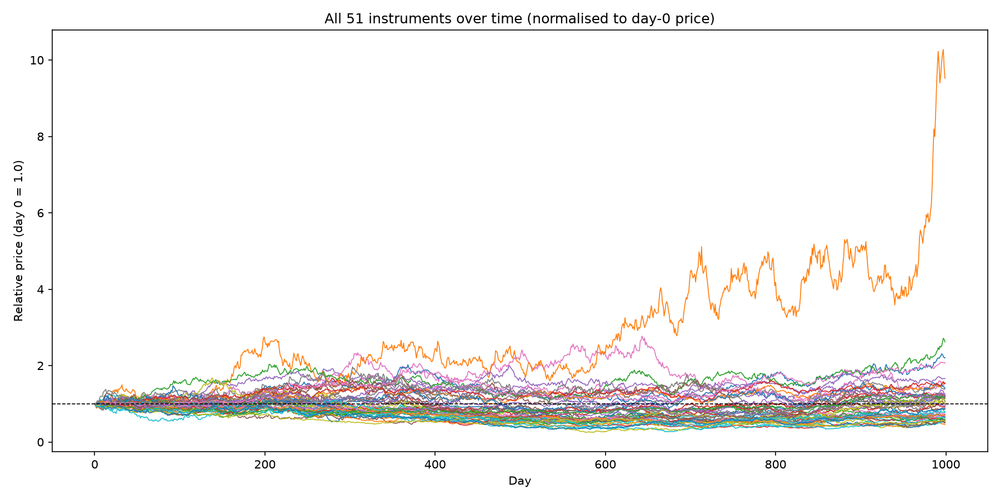
